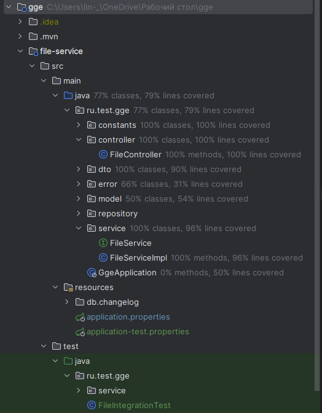
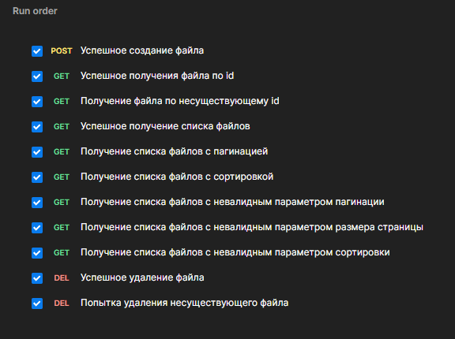
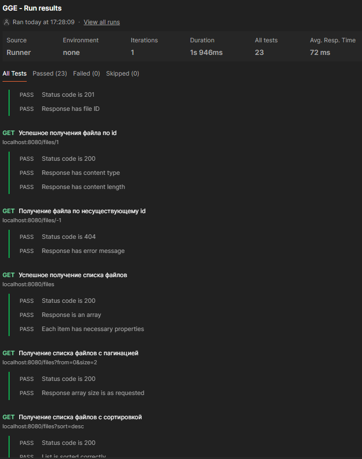

## Описание проекта

Проект представляет собой Spring Boot микросервис, который предоставляет REST API для сохранения, получения и удаления
файлов, а также получения списка файлов. Файлы при сохранении делятся на чанки определенного размера и хранятся в базе
данных.

## Технологический стек

- **Spring Boot 3.2.3:** Основа микросервиса.
- **Spring Data JPA:** ORM для взаимодействия с базой данных.
- **PostgreSQL:** Используемая система управления базами данных.
- **Liquibase:** Инструмент для миграций базы данных с использованием XML-ченджсетов.
- **OpenApi Swagger:** Библиотека для документирования API с помощью Swagger UI.

## Развертывание

### Докеризация

Для контейнеризации приложения предоставлены Dockerfile и docker-compose конфигурация.
Для сборки и запуска перейдите в основную директорию и используйте следующие команды:

```bash
docker-compose build
docker-compose up
```

### Конфигурация

- Размер чанка файлов настраивается через переменную окружения `file.chunk.size`.
- Максимальный размер загрузки файлов настраивается через переменную окружения `max-file-size`.
- Максимальный размер запроса настраивается через переменную окружения `max-request-size`.

## Миграции

- С помощью Liquibase происходит инициализация двух таблиц в базе данных: **files** и **file_chunks**
- А также создание двух начальных текстовый файлов: **test_file_1.txt** и **test_file_2.txt**

## Тесты

- Создан 1 интеграционный тест, который тестирует все 4 метода контроллера, а также несколько тестов для проверки
  сервиса
- 

- Тесты проводились с помощью postman, их можно найти в папке **postman/GGE.postman_collection.json**:
- 
- 

## API

### Загрузка файла

- **POST /files/upload**
    - Загружает файл, разбивая его на чанки.
    - Возвращает идентификатор сохраненного файла.

### Получение списка файлов

- **GET /files**
    - Возвращает список файлов с поддержкой пагинации и сортировки по id.

### Скачивание файла

- **GET /files/{id}**
    - Возвращает файл по его идентификатору, собирая его из чанков.

### Удаление файла

- **DELETE /files/{id}**
    - Удаляет файл и его чанки по идентификатору.

## Обработка ошибок

- Обработчики исключений предоставляют информацию об ошибках через стандартизированные HTTP-ответы.

## Документация API

- Доступна через Swagger UI по адресу `/swagger-ui.html`.

## Примеры использования

### Загрузка файла

```bash
curl -F "file=@path/to/your/file" http://localhost:8080/files/upload
```

### Получение списка файлов

```bash
curl http://localhost:8080/files?from=0&size=10&sort=asc
```

### Скачивание файла

```bash
curl http://localhost:8080/files/{id} --output file
```

### Удаление файла

```bash
curl -X DELETE http://localhost:8080/files/{id}
```
